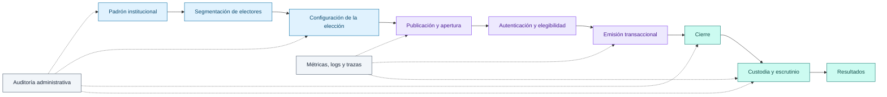
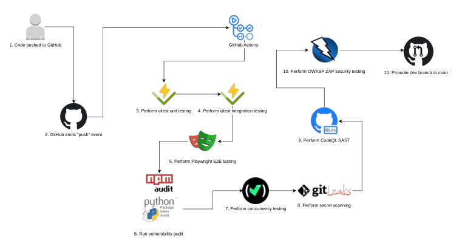

<div align="center">

# TEE Voting System · Backend

### Infraestructura electoral diseñada para que identidad, elegibilidad, sufragio y escrutinio sean procesos verificables.

API de producción del sistema de votación electrónica del **Tribunal Electoral Estudiantil del Instituto Tecnológico de Costa Rica**. Centraliza el padrón, el ciclo de vida de las elecciones, la emisión transaccional del voto, el escrutinio por custodios y la trazabilidad operativa.

<br>

[](https://nodejs.org/)
[](https://www.typescriptlang.org/)
[](https://expressjs.com/)
[](https://www.postgresql.org/)

[](https://supabase.com/)
[](https://vercel.com/)
[](https://opentelemetry.io/)
[](https://github.com/JoseZum/sistema-electoral-backend/actions/workflows/ci.yml)

<sub>REST API · Microsoft Entra ID · JWT · Voto transaccional · Auditoría · Observabilidad · DevSecOps</sub>

<br><br>

**[Producto](#una-elección-completa-no-solo-un-endpoint-de-voto) · [Garantías](#garantías-de-integridad-electoral) · [Arquitectura](#arquitectura-del-sistema) · [Ejecución](#ponerlo-en-marcha) · [Calidad](#calidad-seguridad-y-entrega)**

</div>

---

## Una elección completa, no solo un endpoint de voto

El backend modela la elección como un proceso de extremo a extremo. La identidad institucional es únicamente el punto de entrada: las reglas críticas de elegibilidad, unicidad, anonimato, cierre y publicación se resuelven en la aplicación y en PostgreSQL.

| Etapa | Qué resuelve el sistema | Evidencia técnica |
| :-- | :-- | :-- |
| **Preparar** | Mantiene el padrón, administradores y agrupaciones reutilizables de electores. | Importación XLSX, CRUD de estudiantes, tags y catálogo institucional. |
| **Diseñar** | Configura elecciones simples o jerárquicas, ventanas de tiempo y fuentes de votantes. | Estados controlados, opciones, subopciones, presets y filtros de padrón. |
| **Habilitar** | Materializa quién puede participar en cada proceso electoral. | Relación `election_voters`, población por padrón, tag, filtro o selección manual. |
| **Votar** | Valida acceso, ventana electoral y unicidad antes de confirmar el sufragio. | Servicios de dominio y procedimientos almacenados transaccionales. |
| **Proteger** | Separa la identidad del contenido del voto cuando la elección es anónima. | Tokens aleatorios, SHA-256, AES-256-GCM y eliminación del material sensible consumido. |
| **Escrutar** | Controla la liberación de resultados mediante custodios y un umbral configurable. | Llaves almacenadas como hash, bloqueo de estado y finalización idempotente. |
| **Evidenciar** | Conserva trazabilidad administrativa sin exponer eventos privados de votación. | Contexto de auditoría, triggers SQL, filtros de privacidad y exportaciones controladas. |
| **Operar** | Permite observar salud, rendimiento y saturación durante una elección. | Health checks, logs estructurados, métricas de dominio y trazas OpenTelemetry. |

## Trayectoria electoral



## Garantías de integridad electoral

La seguridad no depende de una única validación en el controlador. Las invariantes críticas se distribuyen deliberadamente entre identidad, aplicación y persistencia.

| Garantía | Implementación |
| :-- | :-- |
| **Identidad institucional** | El ID token de Microsoft se valida con JWKS, firma RS256, audiencia e issuer permitido. Solo se aceptan cuentas `@estudiantec.cr` presentes en el padrón. |
| **Sesión y autorización** | La API emite un JWT propio; `authenticate` valida la sesión y `requireAdmin` vuelve a resolver los privilegios administrativos contra PostgreSQL. |
| **Elegibilidad** | Cada elección mantiene su conjunto explícito de electores. Estar autenticado no implica automáticamente tener derecho a votar. |
| **Unicidad del sufragio** | Procedimientos SQL, filas bloqueadas con `FOR UPDATE` e índices únicos impiden reutilizar un token o emitir dos votos para la misma papeleta. |
| **Anonimato** | El voto anónimo persiste un hash de token en lugar del `student_id`. La asociación operativa usa material cifrado con AES-256-GCM y lo elimina al consumirse. |
| **Atomicidad** | Registro del voto, consumo del token y actualización de participación ocurren dentro de la misma transacción de PostgreSQL. |
| **Escrutinio controlado** | Las llaves se generan con aleatoriedad criptográfica, se almacenan como hash y deben alcanzar el umbral `min_keys` antes de finalizar. |
| **Privacidad operativa** | El logger redacta campos sensibles; métricas y trazas excluyen correo, carné, tokens y contenido del voto. |
| **Trazabilidad** | Los cambios administrativos se registran mediante contexto de actor y triggers; los recursos privados de votación se excluyen de las consultas de auditoría. |

## Arquitectura del sistema

La solución se despliega como una **API Express serverless en Vercel**, conectada mediante TLS al transaction pooler de **Supabase PostgreSQL**. Microsoft Entra ID aporta identidad institucional y Grafana Cloud recibe telemetría vía OTLP cuando la observabilidad está habilitada.


### Arquitectura interna

El código sigue una arquitectura modular por dominio con separación entre transporte, reglas de negocio y persistencia:

```text
HTTPS / JSON
     │
     ▼
Helmet · CORS · Rate limiting · Métricas HTTP
     │
     ▼
Routes ──► Authentication / Authorization
     │
     ▼
Controllers ──► Services ──► Repositories ──► PostgreSQL
                    │                              │
                    │                              ├─ constraints
                    │                              ├─ stored procedures
                    │                              └─ audit triggers
                    │
                    └─ errores tipados · métricas de dominio
```

`src/index.ts` configura y exporta la aplicación sin abrir un puerto. Esto permite utilizar el mismo núcleo en dos entornos:

- `src/server.ts`: proceso Node.js persistente para desarrollo y Docker.
- `src/api/index.ts`: entrada compatible con funciones serverless de Vercel.

### Módulos de dominio

| Módulo | Responsabilidad |
| :-- | :-- |
| `auth` | Validación de Microsoft Entra ID, resolución de identidad y emisión de sesiones. |
| `users` | Padrón electoral, catálogo institucional, importaciones y administradores. |
| `tags` | Segmentos reutilizables de estudiantes para asignación electoral. |
| `elections` | Ciclo de vida, opciones, subopciones, votantes, monitoreo y resultados administrativos. |
| `voting` | Elecciones disponibles, construcción de papeletas, emisión y resultados públicos autorizados. |
| `scrutiny` | Custodios, llaves, progreso, umbral y finalización del escrutinio. |
| `dashboard` | Indicadores operativos y agregados del sistema. |
| `audit` | Consulta, estadísticas, exportación y purga trazable de eventos administrativos. |

### Persistencia como última línea de defensa

Los scripts de [`supabase/schema`](./supabase/schema/) forman parte del diseño, no son únicamente archivos de inicialización:

| Script | Responsabilidad |
| :-- | :-- |
| [`01-schema.sql`](./supabase/schema/01-schema.sql) | Entidades, enums, relaciones, índices y restricciones de integridad. |
| [`02-storedprocedures.sql`](./supabase/schema/02-storedprocedures.sql) | Voto anónimo y nominal, papeletas jerárquicas e importación transaccional. |
| [`03-seed.sql`](./supabase/schema/03-seed.sql) | Escenario reproducible de desarrollo y validación. |
| [`04-triggers.sql`](./supabase/schema/04-triggers.sql) | Auditoría automática y mantenimiento de timestamps. |

## Superficie funcional de la API

La API se publica bajo `/api`. La autorización se aplica por módulo y por operación: el recorrido del votante requiere una sesión válida, mientras que padrón, elecciones, tags, escrutinio, dashboard y las operaciones sensibles de auditoría exigen privilegios administrativos. Autenticación y health checks constituyen la superficie pública de infraestructura.

| Recurso | Prefijo | Capacidades principales |
| :-- | :-- | :-- |
| Autenticación | `/api/auth` | Intercambio del ID token de Microsoft por una sesión del sistema. |
| Padrón y administradores | `/api/users` | Consulta, CRUD, catálogo e importación XLSX. |
| Elecciones | `/api/elections` | Configuración, estados, opciones, electores, monitoreo y resultados. |
| Segmentos | `/api/tags` | CRUD de tags y gestión de miembros. |
| Votación | `/api/voting` | Elecciones habilitadas, papeleta, voto y resultados disponibles. |
| Escrutinio | `/api/scrutiny` | Custodios, entrega de llaves, progreso y finalización. |
| Auditoría | `/api/audit` | Búsqueda, estadísticas, días activos, exportación y purga controlada. |
| Dashboard | `/api/dashboard` | Estadísticas agregadas para operación administrativa. |
| Salud | `/api/health` | Liveness de aplicación y readiness de base de datos. |

### Ejemplo de autenticación

```http
POST /api/auth/microsoft
Content-Type: application/json

{
  "idToken": "<microsoft-id-token>"
}
```

Las solicitudes posteriores utilizan la sesión emitida por el backend:

```http
Authorization: Bearer <tee-session-jwt>
```

## Ponerlo en marcha

### Requisitos

- Node.js 20 o superior —el pipeline utiliza Node.js 22—.
- npm.
- PostgreSQL 16 o Docker con Compose.
- Una aplicación registrada en Microsoft Entra ID para probar el login real.

### Desarrollo local

```bash
cp .env.example .env
npm ci
docker compose -f docker-compose.e2e.yml up -d postgres
npm run dev
```

El servicio queda disponible en `http://localhost:3001`.

| Recurso | URL |
| :-- | :-- |
| Liveness | `http://localhost:3001/api/health` |
| Readiness de PostgreSQL | `http://localhost:3001/api/health/db` |

Los scripts SQL se cargan automáticamente cuando el volumen de PostgreSQL se crea por primera vez. Para detener la base:

```bash
docker compose -f docker-compose.e2e.yml down
```

### Configuración

No se deben versionar secretos. [`.env.example`](./.env.example) documenta el contrato completo.

| Variable | Requerida | Propósito |
| :-- | :--: | :-- |
| `PORT` | No | Puerto del proceso local; por defecto `3001`. |
| `NODE_ENV` | Sí | Entorno de ejecución. |
| `AZURE_CLIENT_ID` | Sí | Audiencia esperada para tokens de Microsoft. |
| `AZURE_TENANT_ID` | Sí | Tenant utilizado por la integración institucional. |
| `JWT_SECRET` | Sí | Firma de las sesiones emitidas por el backend. |
| `VOTE_TOKEN_SECRET` | Sí | Derivación de hashes y cifrado del material de voto. |
| `DATABASE_URL` | Sí | Conexión PostgreSQL; obligatoria en Vercel. |
| `DATABASE_POOL_MAX` | No | Máximo de conexiones; usar `1` en serverless. |
| `DATABASE_SSL` | No | Se activa automáticamente para conexiones Supabase. |
| `CORS_ORIGIN` | Sí | Uno o varios orígenes permitidos, separados por coma. |
| `OTEL_EXPORTER_OTLP_ENDPOINT` | No | Activa la exportación de métricas y trazas. |
| `OBSERVABILITY_ENABLED` | No | Permite desactivar telemetría aun cuando exista un endpoint. |

Genera secretos independientes y de alta entropía para producción:

```bash
openssl rand -hex 32
```

### Despliegue serverless

[`vercel.json`](./vercel.json) dirige `/api/*` a `src/api/index.ts`. En producción:

1. Configura las variables con scope `Production`.
2. Utiliza el **Transaction pooler** de Supabase en `DATABASE_URL`.
3. Configura `DATABASE_POOL_MAX=1` para limitar conexiones por instancia serverless.
4. Restringe `CORS_ORIGIN` al dominio real del frontend.
5. Valida `/api/health/db` en Preview antes de promover.

La aplicación detecta conexiones Supabase, habilita TLS y normaliza los parámetros de la URL para que `pg` controle la configuración SSL.

## Observabilidad orientada a la operación electoral

La instrumentación es **opt-in**: sin `OTEL_EXPORTER_OTLP_ENDPOINT`, el SDK no se inicializa. Esto permite que el servicio degrade de forma segura sin convertir la plataforma de observabilidad en una dependencia de disponibilidad.

| Señal | Cobertura |
| :-- | :-- |
| Métricas HTTP | Throughput, latencia y clases de estado por ruta. |
| Métricas de dominio | Votos confirmados y errores categorizados, sin dimensiones identificatorias. |
| Pool PostgreSQL | Conexiones totales, inactivas y solicitudes en espera. |
| Trazas | Instrumentación de HTTP, Express y `pg`; query strings redactados. |
| Logs | JSON estructurado con correlación de traza y saneamiento de campos sensibles. |

La guía de Grafana Cloud, el entorno LGTM local y las verificaciones anti-PII están en [`docs/observabilidad/README.md`](./docs/observabilidad/README.md).

## Calidad, seguridad y entrega

La rama `dev` solo se promueve a `main` después de superar el pipeline completo. El workflow también se ejecuta en pull requests hacia `dev` y `main`, y admite ejecución manual.



| Gate | Herramienta | Qué protege |
| :-- | :-- | :-- |
| Política de ramas | GitHub Actions | Impide promociones directas hacia `main` desde ramas distintas de `dev`. |
| Pruebas unitarias | Vitest | Servicios, controladores, repositorios, errores y observabilidad. |
| Pruebas de integración | Vitest | Contratos entre módulos, base de datos y reglas de negocio. |
| End-to-end | Playwright + Docker | Recorridos completos con frontend, backend y PostgreSQL reales. |
| Dependencias | `npm audit` / `pip-audit` condicional | Bloquea vulnerabilidades altas o críticas en manifiestos detectados. |
| Concurrencia | Vitest + PostgreSQL | Doble voto, voto durante cierre, escrutinio simultáneo y stored procedures. |
| Secretos | Gitleaks | Evita exponer credenciales o material sensible en el historial. |
| SAST | CodeQL | Analiza vulnerabilidades en JavaScript y TypeScript. |
| DAST | OWASP ZAP | Escanea dinámicamente la superficie HTTP de la API. |
| Promoción | Fast-forward verificado | Mueve `main` exactamente al commit de `dev` que superó todos los gates. |

Los reportes de Playwright, logs del entorno E2E y resultados de ZAP se conservan como artefactos de GitHub Actions para diagnóstico.

### Suites de prueba

```text
tests/
├── unit/          # comportamiento aislado por capa y dominio
├── integration/   # integración HTTP, servicios y persistencia
├── e2e/           # recorridos reales sobre el stack completo
├── concurrency/   # invariantes bajo contención PostgreSQL
└── security/      # auditoría de dependencias y OWASP ZAP
```

## Comandos que importan

| Comando | Propósito |
| :-- | :-- |
| `npm run dev` | Ejecuta la API con recarga mediante Nodemon. |
| `npm run typecheck` | Valida TypeScript sin emitir artefactos. |
| `npm run build` | Compila el backend en `dist/`. |
| `npm start` | Ejecuta la compilación de producción. |
| `npm test -- --run` | Ejecuta las suites Vitest no E2E. |
| `npm run test:concurrency` | Ejecuta las pruebas de concurrencia secuencialmente. |
| `npm run test:concurrency:docker` | Valida concurrencia contra PostgreSQL aislado. |
| `npm run test:security` | Audita dependencias de producción. |
| `npm run test:security:zap` | Levanta el entorno y ejecuta el escaneo DAST. |
| `npm run test:dashboard:smoke` | Verifica las consultas agregadas del dashboard. |

## Estructura del repositorio

```text
.
├── src/
│   ├── api/              # entrada serverless para Vercel
│   ├── config/           # entorno, PostgreSQL, CORS y auditoría
│   ├── errors/           # taxonomía de errores de aplicación
│   ├── middleware/       # seguridad, autorización, métricas y errores
│   ├── modules/          # dominios funcionales
│   ├── observability/    # logs, métricas y bootstrap OpenTelemetry
│   ├── index.ts          # composición de la aplicación Express
│   └── server.ts         # proceso local persistente
├── supabase/schema/      # esquema, procedimientos, seed y triggers
├── tests/                # unit, integration, E2E, concurrency y security
├── observability/        # Grafana LGTM y dashboard importable
├── docs/                 # documentación operativa
└── .github/workflows/    # pipeline DevSecOps
```

## Estado y responsabilidad

Este repositorio contiene el backend operativo del TEE Voting System. Los cambios de producción deben ingresar por `dev`, conservar compatibilidad con el esquema PostgreSQL y superar la cadena completa de calidad y seguridad antes de alcanzar `main`.

La documentación describe controles implementados, pero no sustituye una auditoría independiente, un ejercicio formal de threat modeling ni los procedimientos institucionales requeridos para cada elección.

<div align="center">

Desarrollado en el **Instituto Tecnológico de Costa Rica**

`identity → eligibility → vote → scrutiny → evidence`

</div>
