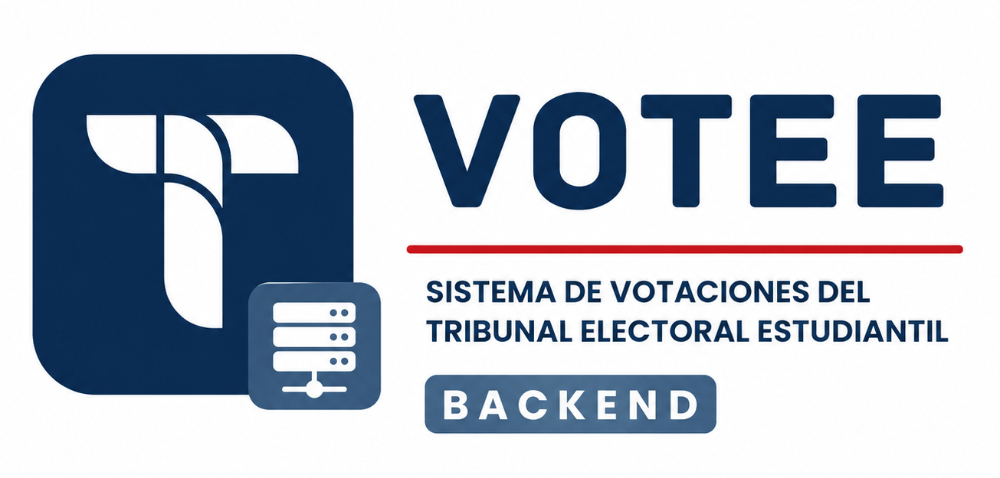
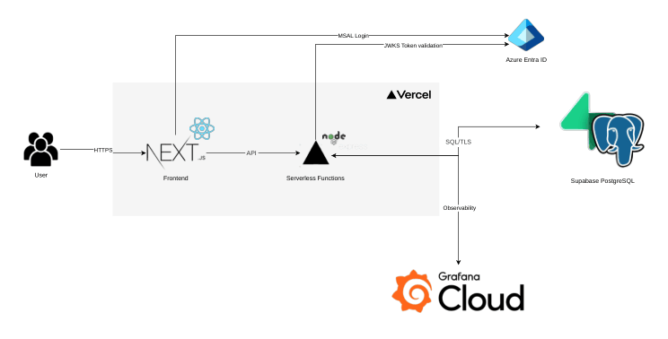

<div align="center">



# TEE Voting System - Backend

Infraestructura electoral de producción del Tribunal Electoral Estudiantil del Instituto Tecnológico de Costa Rica. Centraliza identidad, padrón, elegibilidad, voto, escrutinio y evidencia operativa en una API diseñada para procesos electorales verificables.

[](https://nodejs.org/)
[](https://www.typescriptlang.org/)
[](https://expressjs.com/)
[](https://www.postgresql.org/)
[](https://opentelemetry.io/)
[](https://github.com/JoseZum/sistema-electoral-backend/actions/workflows/ci.yml)

**[Capacidades](#capacidades-principales) · [Garantías](#garantías-electorales) · [Arquitectura](#arquitectura-de-producción) · [Instalación](#instalación-local) · [Frontend](https://github.com/JoseZum/sistema-electoral-frontend)**

</div>

---

## Capacidades principales

| Área | Responsabilidad |
| :-- | :-- |
| **Administración electoral** | Gestiona padrón, segmentos, configuración, ciclo de vida y monitoreo de elecciones. |
| **Identity** | Valida cuentas institucionales mediante Microsoft Entra ID y emite sesiones propias del sistema. |
| **Eligibility** | Determina quién puede participar en cada elección; autenticarse no equivale a estar habilitado para votar. |
| **Voting** | Emite votos de forma transaccional, protege contra duplicados y separa la identidad del sufragio anónimo. |
| **Scrutiny & Evidence** | Controla la liberación de resultados mediante custodios y conserva auditoría, métricas, logs y trazas sin exponer el voto. |

## Garantías electorales

La API aplica las invariantes electorales en varias capas: Microsoft Entra ID valida la identidad, PostgreSQL controla elegibilidad, unicidad y atomicidad, los votos anónimos no persisten `student_id`, y el escrutinio exige alcanzar el umbral configurado de custodios.

| Garantía | Implementación |
| :-- | :-- |
| **Identidad y autorización** | Validación de tokens Microsoft con JWKS, firma, audiencia e issuer; sesiones JWT propias y privilegios administrativos resueltos contra PostgreSQL. |
| **Elegibilidad** | Cada elección mantiene su conjunto explícito de electores. |
| **Unicidad y atomicidad** | Índices únicos, bloqueos y procedimientos SQL transaccionales impiden el doble voto y mantienen consistencia. |
| **Anonimato** | El voto anónimo persiste un hash de token, no el `student_id`; el material operativo se elimina al consumirse. |
| **Escrutinio y auditoría** | Llaves almacenadas como hash, umbral de custodios, triggers administrativos y telemetría sin datos personales ni contenido de voto. |

## Arquitectura de producción

La solución se despliega como una API Express serverless en **Vercel**, conectada por TLS al transaction pooler de **Supabase PostgreSQL**. Microsoft Entra ID aporta identidad institucional y Grafana Cloud recibe telemetría vía OTLP cuando la observabilidad está habilitada.



El código se organiza por dominios y separa transporte, reglas de negocio y persistencia: `routes → controllers → services → repositories`. `src/index.ts` compone la aplicación sin abrir un puerto; `src/server.ts` la ejecuta localmente y `src/api/index.ts` la expone como función serverless en Vercel.

PostgreSQL actúa como última línea de defensa mediante constraints, procedimientos transaccionales, índices únicos y triggers de auditoría. Explora el [esquema de base de datos](./supabase/schema/).

## Tecnologías

| Área | Tecnologías |
| :-- | :-- |
| **Core** | Node.js, TypeScript, Express y PostgreSQL |
| **Platform** | Supabase, Vercel y Docker |
| **Identity & security** | Microsoft Entra ID, JWT, Helmet, Gitleaks, CodeQL y OWASP ZAP |
| **Observability** | OpenTelemetry y Grafana Cloud |
| **Testing** | Vitest, Playwright y GitHub Actions |

## Instalación local

### Requisitos

- Node.js 20 o superior.
- npm.
- PostgreSQL 16 o Docker con Compose.
- Una aplicación registrada en Microsoft Entra ID para probar el login real.

```bash
cp .env.example .env
npm ci
docker compose -f docker-compose.e2e.yml up -d postgres
npm run dev
```

El servicio queda disponible en `http://localhost:3001`.

Configura PostgreSQL, Microsoft Entra ID y secretos independientes para sesión y voto. Consulta [`.env.example`](./.env.example) para el contrato completo y genera secretos de alta entropía con:

```bash
openssl rand -hex 32
```

En producción, Vercel utiliza el transaction pooler de Supabase. El despliegue requiere variables de entorno de producción, CORS restringido y una verificación exitosa de readiness en `/api/health/db`.

### Comandos habituales

```bash
npm run dev
npm run build
npm test -- --run
npm run test:concurrency:docker
npm run test:security
```

## Observabilidad

- Logs estructurados con correlación de trazas.
- Métricas HTTP y del pool de PostgreSQL.
- Métricas de dominio para votos confirmados y rechazados.
- Trazas OpenTelemetry para HTTP, Express y PostgreSQL.
- Datos electorales sensibles excluidos de la telemetría.

Consulta la [guía de observabilidad](./docs/observabilidad/README.md) y el stack LGTM local.

## Calidad y seguridad

GitHub Actions valida TypeScript, pruebas unitarias e integrales, concurrencia sobre PostgreSQL, E2E con el frontend real, dependencias, secretos, CodeQL y OWASP ZAP antes de promover `dev` a `main`.

La especificación utilizada para las pruebas DAST está disponible en [`tests/security/openapi.json`](./tests/security/openapi.json).

```text
src/                 application code
supabase/schema/     PostgreSQL schema and procedures
tests/               quality and security suites
observability/       local LGTM stack and dashboards
docs/                operational documentation
```

## Repositorios relacionados

- [TEE Voting System — Frontend](https://github.com/JoseZum/sistema-electoral-frontend)
- [Esquema PostgreSQL](./supabase/schema/)
- [Guía de observabilidad](./docs/observabilidad/README.md)

<div align="center">

Desarrollado en el **Instituto Tecnológico de Costa Rica**

</div>
